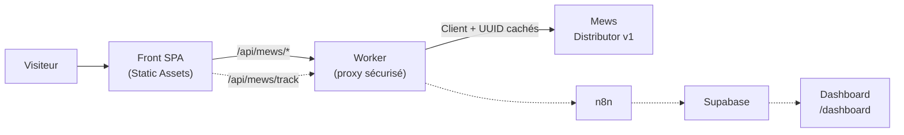
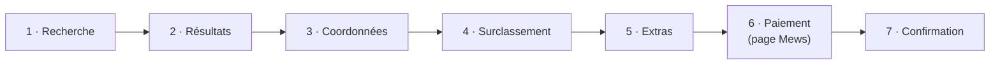
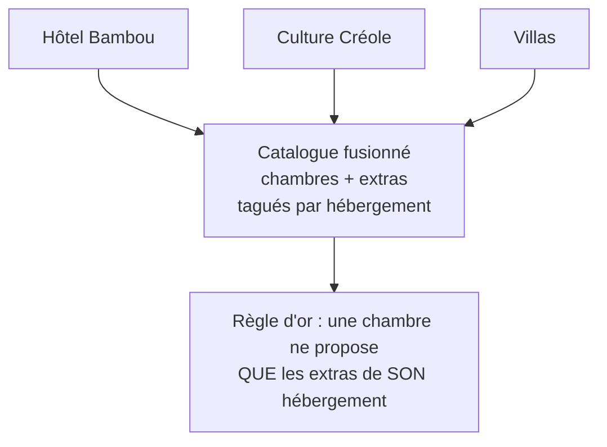
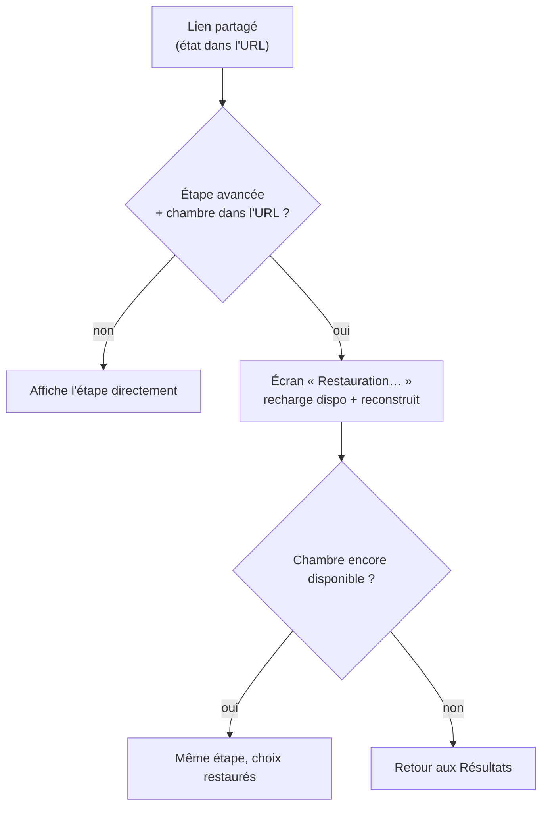
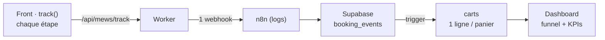

# Bambou Resort — Guide technique & métier

> Carte des flux et des décisions — techniques et métier — pour qu'en arrivant sur le
> projet on sache tout de suite si un comportement observé est **voulu**, une
> **subtilité à connaître**, ou un **vrai bug**.
>
> Stack : **Cloudflare Worker + React/Vite** · PMS : **Mews Distributor v1** · Analytics : **n8n → Supabase**

## Sommaire

1. [Architecture d'ensemble](#1-architecture-densemble)
2. [Le tunnel de réservation](#2-le-tunnel-de-réservation)
3. [Multi-hébergement (3 configs Mews)](#3-multi-hébergement--3-configurations-mews)
4. [Langues FR / EN](#4-langues--fr--en)
5. [Liens partageables & réhydratation](#5-liens-partageables--réhydratation)
6. [Pipeline analytics](#6-pipeline-analytics)
7. [Voulu, ou bug ?](#7-voulu-ou-bug-)
8. [Donnée réelle vs démo](#8-donnée-réelle-mews-vs-démo-en-dur)

---

## 1. Architecture d'ensemble

Le front ne parle **jamais** directement à Mews. Tout passe par des fonctions du Worker
sur la même origine (`/api/mews/*`). Cette frontière unique cache le jeton `Client` et
les UUID de l'établissement, et cure les réponses Mews (≈ 80 devises → EUR seulement).

*Trait plein = réservation en direct · pointillés = suivi analytics (asynchrone, best-effort).*

---

## 2. Le tunnel de réservation

Sept étapes. L'état vit dans les **paramètres d'URL** (dates, hébergements, chambre,
tarif, extras, étape, langue) — ce qui rend chaque lien partageable et rejouable. Le
paiement est délégué à la **page hébergée par Mews** (carte + 3-D Secure), avec retour
sur `/confirmation`.

> Le suivi analytics émet un événement `etape` à **chaque** étape (dès la recherche),
> plus `paiement_initie` et `paiement_valide`. C'est ce qui alimente le funnel du dashboard.

---

## 3. Multi-hébergement — 3 configurations Mews

« Bambou », ce sont en réalité **trois établissements Mews distincts** — Hôtel Bambou,
Culture Créole, Villas — chacun sa configuration. Un seul appel `configuration/get` les
récupère et fusionne le catalogue, en **taguant chaque chambre et chaque extra par son
hébergement**.

Conséquence importante : dans Mews, un **produit (extra) appartient à une seule config**.
Réserver une chambre Culture Créole avec un petit-déjeuner « Hôtel Bambou » est refusé
par Mews (`product invalid`). Le moteur filtre donc les extras selon l'hébergement de la
chambre choisie à l'étape 2.

> Une catégorie renvoyée par la dispo mais **absente du catalogue** `configuration/get`
> (sans nom ni photo) est volontairement **masquée** plutôt qu'affichée en carte vide.

---

## 4. Langues — FR / EN

La langue se pilote par `?lang=fr|en` (ou le sélecteur du footer, qui recharge la page
pour tout re-localiser). Elle est envoyée à Mews (`LanguageCode`) — c'est aussi ce qui
fixe la langue de la **page de paiement** et des e-mails.

> **⚠️ À savoir —** le contenu des chambres (noms, descriptions, noms de tarifs comme
> « Non remboursable ») est saisi **en français uniquement** dans le PMS. En anglais,
> l'**interface** est traduite, mais ces textes retombent en français : c'est voulu,
> tant que l'hôtel ne les traduit pas côté Mews.

---

## 5. Liens partageables & réhydratation

Comme l'état complet est dans l'URL, on peut partager sa sélection : le destinataire
arrive à la **même étape** avec les mêmes choix. À l'ouverture d'un lien profond, le
moteur affiche un bref écran « Restauration… », recharge la disponibilité et reconstruit
la chambre/tarif *avant* d'afficher l'étape (pour ne pas rebondir à tort).

> **⚠️ À savoir —** choix assumé : les **coordonnées du voyageur** (nom, e-mail,
> téléphone) sont incluses dans l'URL pour restaurer la saisie. Elles sont donc visibles
> dans l'historique, les logs et par toute personne recevant le lien — à couvrir dans la
> politique de confidentialité.

---

## 6. Pipeline analytics

À chaque étape, le front pousse un événement vers **un unique endpoint n8n** (via le
Worker, pour les logs), qui insère dans Supabase. Un **trigger** Postgres agrège chaque
événement dans une table `carts` (une ligne par panier) que lit le dashboard.

**Atomicité :** l'insert dans `booking_events` et la mise à jour de `carts` forment
**une seule transaction**. Si le trigger échoue, tout est annulé (rien n'est enregistré)
— c'est ce qui garantit qu'on n'a jamais un événement sans son panier.

> « Paiement non abouti » n'est pas un statut envoyé : c'est **déduit** = `paiement_initie`
> sans `paiement_valide`. Or `paiement_valide` ne part que si le client **revient** sur la
> page de confirmation. La validation fiable se fait donc côté n8n, qui rappelle Mews avec
> le `reservationGroupId` présent dans l'événement.

---

## 7. Voulu, ou bug ?

Le tableau à garder sous la main quand on découvre le projet.
**✅ Voulu** = attendu · **⚠️ À savoir** = effet de bord assumé · **❌ Bug** = anormal.

| Comportement observé | Statut | Pourquoi |
|---|---|---|
| Les noms de chambres restent en français en mode anglais | ✅ Voulu | Contenu Mews saisi FR uniquement. L'interface est traduite, pas le catalogue PMS. |
| Aucune villa (ni accordéon « Villas ») sur certaines dates | ✅ Voulu | Zéro disponibilité villa sur ces dates. L'accordéon n'apparaît que s'il y a de la dispo. |
| Un extra apparaît pour une chambre mais pas pour une autre | ✅ Voulu | Les extras sont rattachés à une config Mews ; on ne montre que ceux de l'hébergement de la chambre. |
| « 0 € de frais et commission » affiché sur tous les tarifs | ✅ Voulu | L'API ne permet pas de vérifier la remboursabilité par tarif : on affiche le message sûr (réservation en direct, sans commission plateforme). |
| Un lien partagé retombe sur « Résultats » au lieu de l'étape | ⚠️ À savoir | Normal *si* la chambre n'est plus disponible aux dates. Sinon (chambre dispo), c'est un bug de réhydratation. |
| E-mail / téléphone visibles dans l'URL | ⚠️ À savoir | Choix assumé pour le partage/reprise de panier. Donnée perso dans l'URL → à cadrer côté RGPD. |
| Bref écran « Restauration de votre sélection… » | ✅ Voulu | Réhydratation d'un lien profond : on recharge la dispo avant d'afficher l'étape. |
| Un panier payé apparaît « non abouti » dans le dashboard | ⚠️ À savoir | Le client n'est pas revenu sur `/confirmation` → `paiement_valide` non émis. n8n doit valider via Mews (`reservationGroupId`). |
| `booking_events` vide après une erreur 400 du trigger | ✅ Voulu | Transaction atomique : si le trigger plante, l'insert est annulé (rollback). Cohérence garantie. |
| `/dashboard` affiche « à configurer » | ✅ Voulu | Clé anon Supabase absente de `config.ts`. Une fois renseignée → écran de login. |
| Une chambre « bookable » n'apparaît pas dans la liste | ✅ Voulu | Catégorie présente en dispo mais absente du catalogue `configuration/get` (sans nom/photo) → masquée. |

---

## 8. Donnée réelle (Mews) vs démo (en dur)

Plusieurs éléments de réassurance sont **générés**, pas issus de Mews. À savoir avant de
« débuguer » un chiffre qui bouge tout seul. **🟢 Réel** = vient de Mews · **🟣 Démo** = en dur, à remplacer.

| Élément affiché | Source | Détail |
|---|---|---|
| Disponibilité, prix, tarifs | 🟢 Réel | Mews `getAvailability` / `getPricing`, curés en EUR. |
| Noms, descriptions, photos des chambres | 🟢 Réel | Mews `configuration/get`. |
| « Plus que N chambres » | 🟢 Réel | Basé sur `AvailableRoomCount` de Mews. |
| Conditions générales (lien) | 🟢 Réel | URL fournie par la configuration Mews. |
| Note « 4,2 · 2 064 avis » | 🟣 Démo | En dur. À brancher sur une vraie source d'avis. |
| « 14 personnes consultent ce séjour » | 🟣 Démo | Généré (graine par chambre), pas un compteur réel. |
| « Réservé N fois cette semaine » | 🟣 Démo | Généré. Preuve sociale d'illustration. |
| « Coup de cœur voyageurs » / « Très demandé » | 🟣 Démo | Badges d'illustration (règle simple / graine), pas un signal Mews. |
| Minuteur « Nous gardons votre chambre 10 min » | 🟣 Démo | Visuel d'urgence ; aucune réservation temporaire réelle côté Mews. |

---

*Document d'onboarding — à mettre à jour quand une règle change (idéalement dans le même
commit que le code concerné). En cas de doute sur un comportement non listé ici : le
considérer comme **à investiguer**, pas comme voulu.*
